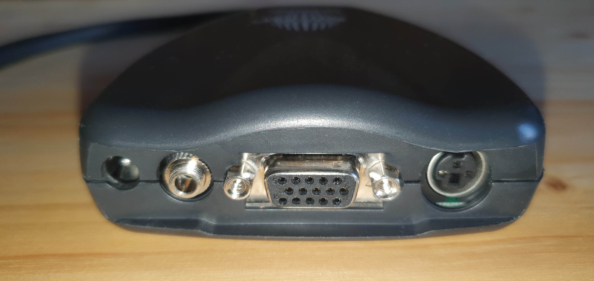
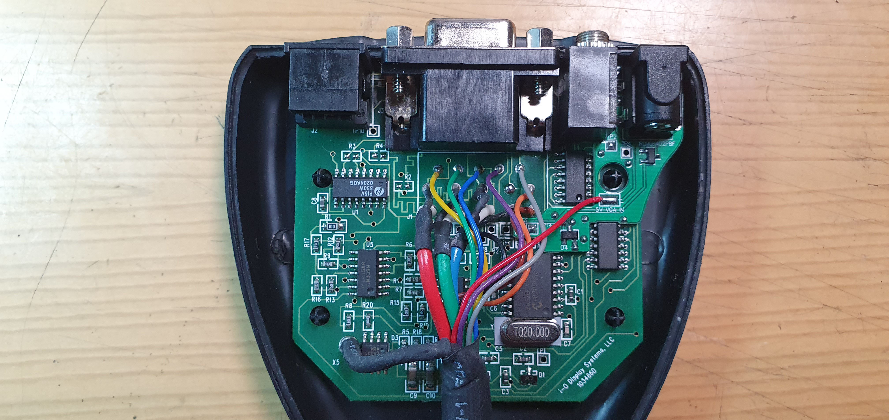

# Addon PCB for powering an eDimensional VGA dongle externally
This is a fairly simple addon PCB designed to fit inside the old eDimensional 3D VGA dongles:

... or similar X3D ones:

... which all looked like this:

This PCB adds a barrel jack to the dongle, which can be used to power it externally:

***Attention:***
It expects the power cable with the centre connection being negative (since i've wanted the internal power mechanically cut while an external power supply is connected):

That's why you may have to build your own USB power cable:

... since USB power cables with a negative centre polarity are hard to find.

An external power supply makes sense for everyone who's into this retro (3D) hardware. In the past this dongles were powered via 5V line from a VESA compliant VGA out connector of a graphics card. Nowadays VGA connectors are mostly gone and modern HDMI-to-VGA-converters do not deliver 5V to their VGA out. So if you want to use this kind of oldschool 3D hardware today on modern hardware (maybe in conjunction with a [DIY 3D-Vision emitter with 3D-Vision glasses](https://github.com/Morpheus-79/3DVisionAVRMod)), you have to power the dongle differently.

The funny thing is:
The first eDimensional dongles came with a cable solution for external power delivery, since earlier graphics cards sometimes did not have a VESA compliant VGA out connector and therefore the 5V pin wasn't connected to anything. So they gave the user an additional pass-through cable, which got its 5V from the PS2 connector:

But since PS2 connectors are gone, too... and since those cables are hard to find: i thought about this more elegant and integrated solution.

## Installation
Multiple board revisions of the PCB inside of the dongle exist. The oldest one seems to be the 103466C. For these ones i've created rev. 1.0 of the addon PCB:

It fits snuggly between the ICs on the right side:

... and has to be mounted with some wires soldered into the vias of the main PCB. The red wire for the internal 5V power delivery has to be desoldered from the main PCB and soldered to the '5V VGA IN' pin of the addon PCB. Testpoint 4 can be rerouted to the addon PCB by soldering 'TP4' of the main PCB to the bottom soldering pad of the addon board (but that's optional). Soldering 'TP13' and 'TP14' from the addon PCB to their counterparts on the main PCB is NOT optional, since those are the main lines for power delivery.

For revision 103466C of the main PCB you have to use rev. 1.1 of the addon PCB:

The installation is almost the same as for revision 103466C. But 'U4' from the main PCB has to be desoldered and put onto the addon PCB:

## Remarks
The addon PCB uses an IRLML6402PBF P-Channel MOSFET as a simple polarity protection. It's an easy and cheap solution with a much lower voltage drop than using a diode.

The barrel jack connector is a very common one. You can get it from different manufacturers on eBay and from every large electronic components supplier (for example [as part no. C22435680 on lcsc.com](http://www.lcsc.com/product-detail/span-style-background-color-ff0-DC-span-Power-Connectors_HanElectricity-DC-050-20_C22435680.html)).
